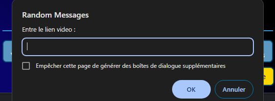

Group Project - 3 students, 2 weeks  
This Chrome extension (built with HTML, CSS and JavaScript) offers numerous distractions on demand in the shape of a pop-up window whenever you need a break from your work. 
No need to look anything up. We provide articles, video games, catchy songs, fun facts along with captivating videos and even pictures of the most adorable cats and dogs you've ever seen.  
  
  
 

If one of the propositions isn't your cup of tea, the red "dislike" button is right there to take the resource out of the list and show you something else. 
On the other hand, the green "like" button adds the resource you're currently viewing to a list of favorites you can later access. 
Lastly, push the "Soumettre" button to add your own easy distraction to the list and have it randomly come up.  
  

